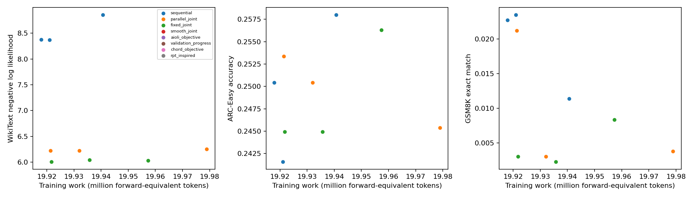
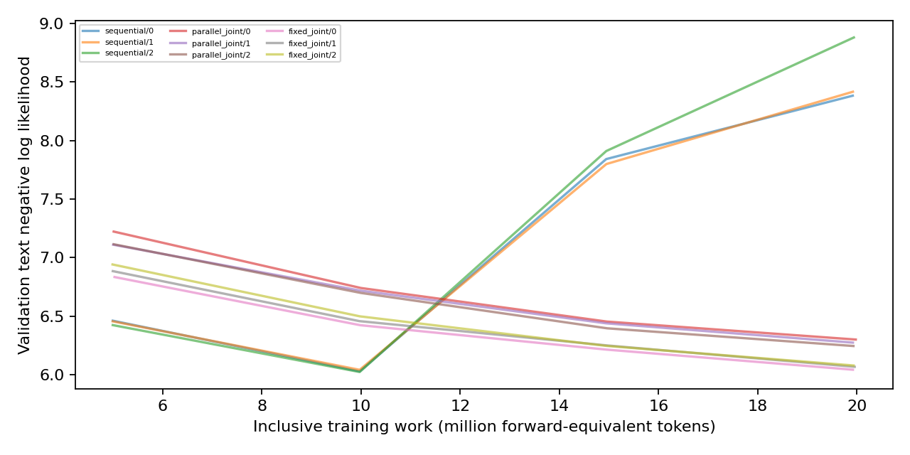

# Pilot results

**Status:** Full-set execution is in progress; missing metrics are unavailable, not zero.

| Method | Seed | Status | Training work (million forward-equivalent tokens) | ARC-Easy accuracy | GSM8K exact match | WikiText NLL | Preference raw / implicit accuracy |
|---|---:|---|---:|---:|---:|---:|---|
| sequential | 0 | complete | 19.918 | 0.2504 [0.2334, 0.2682] | 0.0227 [0.0160, 0.0323] | 8.3725 [8.3531, 8.3909] | 0.5234 [0.4624, 0.5838] / 0.4922 [0.4315, 0.5531] |
| sequential | 1 | complete | 19.921 | 0.2416 [0.2248, 0.2592] | 0.0235 [0.0166, 0.0332] | 8.3701 [8.3468, 8.3929] | 0.5312 [0.4701, 0.5915] / 0.4688 [0.4085, 0.5299] |
| sequential | 2 | complete | 19.941 | 0.2580 [0.2408, 0.2760] | 0.0114 [0.0069, 0.0187] | 8.8562 [8.8332, 8.8797] | 0.5117 [0.4508, 0.5723] / 0.5039 [0.4431, 0.5646] |
| parallel_joint | 0 | complete | 19.979 | 0.2454 [0.2285, 0.2631] | 0.0038 [0.0016, 0.0088] | 6.2521 [6.2239, 6.2815] | 0.4844 [0.4238, 0.5454] / 0.5000 [0.4392, 0.5608] |
| parallel_joint | 1 | complete | 19.921 | 0.2534 [0.2363, 0.2712] | 0.0212 [0.0147, 0.0305] | 6.2255 [6.1981, 6.2545] | 0.5039 [0.4431, 0.5646] / 0.5391 [0.4779, 0.5991] |
| parallel_joint | 2 | complete | 19.932 | 0.2504 [0.2334, 0.2682] | 0.0030 [0.0012, 0.0078] | 6.2258 [6.1987, 6.2543] | 0.5000 [0.4392, 0.5608] / 0.4609 [0.4009, 0.5221] |
| fixed_joint | 0 | complete | 19.922 | 0.2449 [0.2281, 0.2626] | 0.0030 [0.0012, 0.0078] | 6.0072 [5.9779, 6.0383] | 0.5039 [0.4431, 0.5646] / 0.4922 [0.4315, 0.5531] |
| fixed_joint | 1 | complete | 19.957 | 0.2563 [0.2392, 0.2743] | 0.0083 [0.0047, 0.0149] | 6.0337 [6.0050, 6.0651] | 0.5000 [0.4392, 0.5608] / 0.5469 [0.4857, 0.6067] |
| fixed_joint | 2 | complete | 19.936 | 0.2449 [0.2281, 0.2626] | 0.0023 [0.0008, 0.0067] | 6.0435 [6.0148, 6.0742] | 0.5117 [0.4508, 0.5723] / 0.5312 [0.4701, 0.5915] |
| smooth_joint | 0 | pending | unavailable | unavailable | unavailable | unavailable | unavailable |
| smooth_joint | 1 | pending | unavailable | unavailable | unavailable | unavailable | unavailable |
| smooth_joint | 2 | pending | unavailable | unavailable | unavailable | unavailable | unavailable |
| aioli_objective | 0 | pending | unavailable | unavailable | unavailable | unavailable | unavailable |
| aioli_objective | 1 | pending | unavailable | unavailable | unavailable | unavailable | unavailable |
| aioli_objective | 2 | pending | unavailable | unavailable | unavailable | unavailable | unavailable |
| validation_progress | 0 | pending | unavailable | unavailable | unavailable | unavailable | unavailable |
| validation_progress | 1 | pending | unavailable | unavailable | unavailable | unavailable | unavailable |
| validation_progress | 2 | pending | unavailable | unavailable | unavailable | unavailable | unavailable |
| chord_objective | 0 | pending | unavailable | unavailable | unavailable | unavailable | unavailable |
| chord_objective | 1 | pending | unavailable | unavailable | unavailable | unavailable | unavailable |
| chord_objective | 2 | pending | unavailable | unavailable | unavailable | unavailable | unavailable |
| rpt_inspired | 0 | pending | unavailable | unavailable | unavailable | unavailable | unavailable |
| rpt_inspired | 1 | pending | unavailable | unavailable | unavailable | unavailable | unavailable |
| rpt_inspired | 2 | pending | unavailable | unavailable | unavailable | unavailable | unavailable |

NLL = negative log likelihood; preference raw ordering is the preference endpoint, implicit ordering is diagnostic. Scratch primary: WikiText NLL; early-checkpoint primary: ARC-Easy normalized accuracy. Unassisted GSM8K remains a sparse secondary diagnostic.

Intervals: 95% Wilson binary-item score, conditional on each trained model; p-val=n/a (no hypothesis test). Three seeds do not establish universal superiority. Aioli, CHORD (Controllable Harmonization of On- and Off-Policy Reinforcement Learning via Dynamic Weighting), and RPT (Reinforcement Pre-Training) are declared adaptations; exact CHERRY-RL identity remains unresolved.

Complete: 9/24. See `expt_v1/PROTOCOL.md` and the program review reconciliation.

Seed uncertainty, two-stage seed/item intervals, initial-checkpoint changes and all paired comparisons: `expt_v1/analysis.json`. Missing trained seeds remain missing with separate accuracy sensitivity bounds. p-val=n/a throughout; no formal superiority verdict.

**Each point represents one completed seed.** Endpoints are shown against inclusive training work; missing cells remain in the table and no frontier superiority is claimed.

**Controller-set language loss is observed at fixed work milestones.** Curves are descriptive monitoring evidence, separate from development selection and terminal test results.
