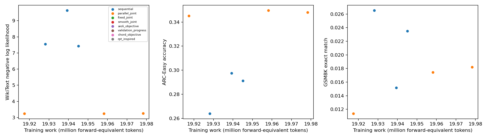
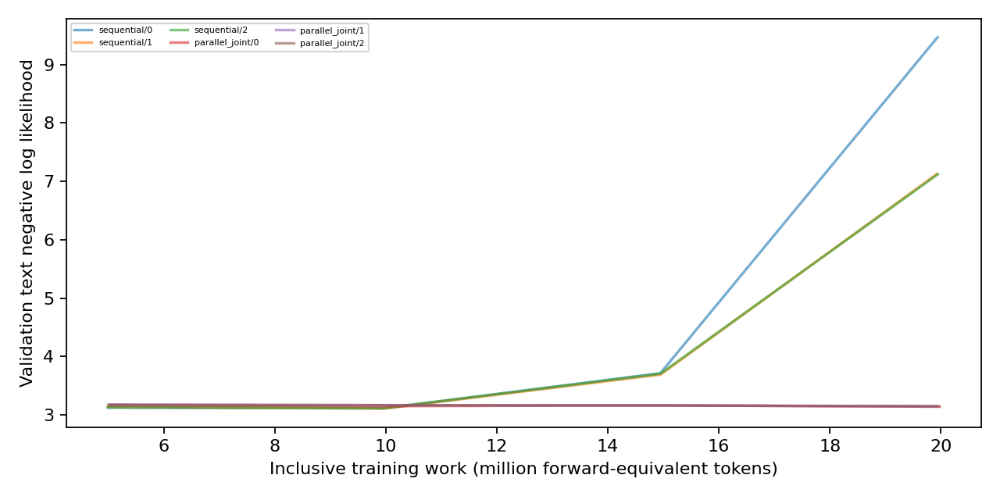

# Pilot results

**Status:** Full-set execution is in progress; missing metrics are unavailable, not zero.

| Method | Seed | Status | Training work (million forward-equivalent tokens) | ARC-Easy accuracy | GSM8K exact match | WikiText NLL | Preference raw / implicit accuracy |
|---|---:|---|---:|---:|---:|---:|---|
| sequential | 0 | complete | 19.939 | 0.2976 [0.2795, 0.3163] | 0.0152 [0.0098, 0.0233] | 9.6419 [9.5743, 9.7074] | 0.5312 [0.4701, 0.5915] / 0.3906 [0.3329, 0.4516] |
| sequential | 1 | complete | 19.928 | 0.2639 [0.2466, 0.2820] | 0.0265 [0.0191, 0.0367] | 7.5458 [7.4961, 7.5963] | 0.5781 [0.5169, 0.6370] / 0.5000 [0.4392, 0.5608] |
| sequential | 2 | complete | 19.945 | 0.2912 [0.2733, 0.3098] | 0.0235 [0.0166, 0.0332] | 7.4249 [7.3635, 7.4874] | 0.5078 [0.4469, 0.5685] / 0.4414 [0.3819, 0.5027] |
| parallel_joint | 0 | complete | 19.978 | 0.3481 [0.3292, 0.3674] | 0.0182 [0.0123, 0.0269] | 3.2496 [3.2193, 3.2791] | 0.6484 [0.5881, 0.7043] / 0.6016 [0.5405, 0.6596] |
| parallel_joint | 1 | complete | 19.917 | 0.3451 [0.3263, 0.3645] | 0.0114 [0.0069, 0.0187] | 3.2442 [3.2150, 3.2729] | 0.6016 [0.5405, 0.6596] / 0.5508 [0.4895, 0.6105] |
| parallel_joint | 2 | complete | 19.958 | 0.3497 [0.3308, 0.3692] | 0.0174 [0.0116, 0.0260] | 3.2424 [3.2127, 3.2711] | 0.5859 [0.5248, 0.6446] / 0.4688 [0.4085, 0.5299] |
| fixed_joint | 0 | pending | unavailable | unavailable | unavailable | unavailable | unavailable |
| fixed_joint | 1 | pending | unavailable | unavailable | unavailable | unavailable | unavailable |
| fixed_joint | 2 | pending | unavailable | unavailable | unavailable | unavailable | unavailable |
| smooth_joint | 0 | pending | unavailable | unavailable | unavailable | unavailable | unavailable |
| smooth_joint | 1 | pending | unavailable | unavailable | unavailable | unavailable | unavailable |
| smooth_joint | 2 | pending | unavailable | unavailable | unavailable | unavailable | unavailable |
| aioli_objective | 0 | pending | unavailable | unavailable | unavailable | unavailable | unavailable |
| aioli_objective | 1 | pending | unavailable | unavailable | unavailable | unavailable | unavailable |
| aioli_objective | 2 | pending | unavailable | unavailable | unavailable | unavailable | unavailable |
| validation_progress | 0 | pending | unavailable | unavailable | unavailable | unavailable | unavailable |
| validation_progress | 1 | pending | unavailable | unavailable | unavailable | unavailable | unavailable |
| validation_progress | 2 | pending | unavailable | unavailable | unavailable | unavailable | unavailable |
| chord_objective | 0 | pending | unavailable | unavailable | unavailable | unavailable | unavailable |
| chord_objective | 1 | pending | unavailable | unavailable | unavailable | unavailable | unavailable |
| chord_objective | 2 | pending | unavailable | unavailable | unavailable | unavailable | unavailable |
| rpt_inspired | 0 | pending | unavailable | unavailable | unavailable | unavailable | unavailable |
| rpt_inspired | 1 | pending | unavailable | unavailable | unavailable | unavailable | unavailable |
| rpt_inspired | 2 | pending | unavailable | unavailable | unavailable | unavailable | unavailable |

NLL = negative log likelihood; preference raw ordering is the preference endpoint, implicit ordering is diagnostic. Scratch primary: WikiText NLL; early-checkpoint primary: ARC-Easy normalized accuracy. Unassisted GSM8K remains a sparse secondary diagnostic.

Intervals: 95% Wilson binary-item score, conditional on each trained model; p-val=n/a (no hypothesis test). Three seeds do not establish universal superiority. Aioli, CHORD (Controllable Harmonization of On- and Off-Policy Reinforcement Learning via Dynamic Weighting), and RPT (Reinforcement Pre-Training) are declared adaptations; exact CHERRY-RL identity remains unresolved.

Complete: 6/24. See `expt_v1/PROTOCOL.md` and the program review reconciliation.

Seed uncertainty, two-stage seed/item intervals, initial-checkpoint changes and all paired comparisons: `expt_v1/analysis.json`. Missing trained seeds remain missing with separate accuracy sensitivity bounds. p-val=n/a throughout; no formal superiority verdict.

**Each point represents one completed seed.** Endpoints are shown against inclusive training work; missing cells remain in the table and no frontier superiority is claimed.

**Controller-set language loss is observed at fixed work milestones.** Curves are descriptive monitoring evidence, separate from development selection and terminal test results.
